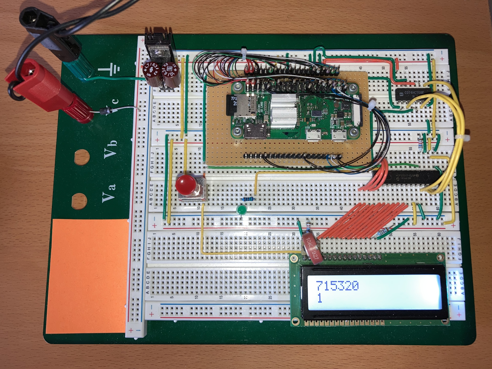

pi-crunch-metal\

==================

pi-crunch-metal computes a million digits of pi
on a bare-metal RaspberryPi(R)-Zero (and other systems).

This fascinating, educational and fun project combines the domain
of high-performance numerical computing with the raw simplicity of
bare-metal embedded microcontroller systems.

Exihbiting the utmost in portability realized through modern header-only C++11
template code, pi-crunch-metal is intended to run out of the box on both
a PC system as well as selected bare-metal microcontroller systems.

The [wide-decimal](https://github.com/ckormanyos/wide-decimal) multiprecision
float back end provides the big-number engine for pi-crunch-metal.
Computation progress can be displayed on either the console (for PC systems)
or on a simple industry-standard LCD character display.

# Software Details

Pi is computed with a quadratically converging Gauss arithmetic geometric mean
iteration. Memory management uses a custom C++ allocator that manages
memory slots aligned to the size of the limb-storage of the individual
multiprecision type.

Multiplication is the hot-spot of this program. The multiplication
implementation uses a combination of school multiplication for low
precision and Karatsuba multiplication for medium percision,
switching directly over to an FFT multiplication scheme
for higher precision.

The microcontroller boots and performs static initialization via self-written
startup code. Hardware setup including clock initialization,
FPU enable, instruction caching, etc. is carried out with self-written
hybrid assembly/C++ code shortly after reaching `main()`.

Compact code size is in focus and the entire project fits within about 40k
of program code, with slight variations depending on the target system selected.
The calculation does, however, require ample RAM of about 16 Mbyte.

GHU/GCC `arm-non-eabi` is used for he target system.
Cros development witn `Win*` and/or `*nin` host is
supported. Build tools and compilers are essentially the same
as those used in the
[`real-time-cpp`](https://github.com/ckormanyos/real-time-cpp)
repository.

# Prototype Project

This repo features a fully-worked-out pi-crunch-metal prototype example project
running on a
[RaspberryPi(R)-Zero](https://www.raspberrypi.org/products/raspberry-pi-zero).
This powerful single-board computer is driven in OS-less, bare-metal mode
directly out-of-the-box.

The build system is set up to use GCC, making use of the `arm-none-eabi`
compiler taken directly from the
[real-time-cpp-toolchains](https://github.com/ckormanyos/real-time-cpp-toolchains)
repository.

The default optimization setting is `-O2` and the million-and-one
decimal digit pi calculation takes slightly under 30 minutes
on this target system with the above-mentioned compiler.

The hardware setup is pictured in the image below.
In this image, the system has successfully completed one full
mega-digit pi calculation and is almost done with a second one.

Traditional wire-wrapping techniques connect the pins on a self-made
breakout board to a solderless prototyping breadboard.
Double and quadruple strands of skinny wire are used on the
power and ground pins, as these might typically carry up to 150mA
of current in this setup.

Bit banging is used to implement an all-software SPI-compatible
driver which controls a port expander chip. The port
expander chip is used to control the pins on an industry-standard
LCD character display.

A classic logic-AND gate converts 3.3V to TTL 5V level.
A little sawed out aluminum chunk is used as a heat-sink to cool
the processor.

The output pin connections from the Rpi-Zero to the logic-AND gate
are shown in the table below.

| Rpi-Zero PIN  | AND-gate PINS   | SPI Function  |
| ------------- | --------------- | ------------- |
| GPIO16/H36    | in 10/9, out 8  | CS            |
| GPIO18/H12    | in 1/2, out 3   | SCK           |
| GPIO19/H35    | in 4/5, out 6   | MOSI          |

The LCD pin connections and the
input/output connections of the port expander chip are clearly
identifiable in the image. The port expander chip uses
hardware addressing and is hard-wired to address 2.
